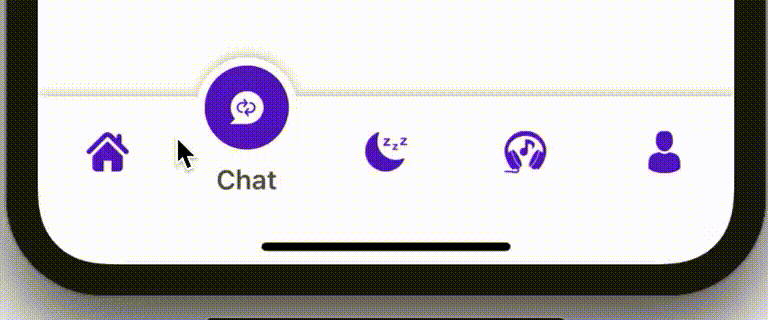
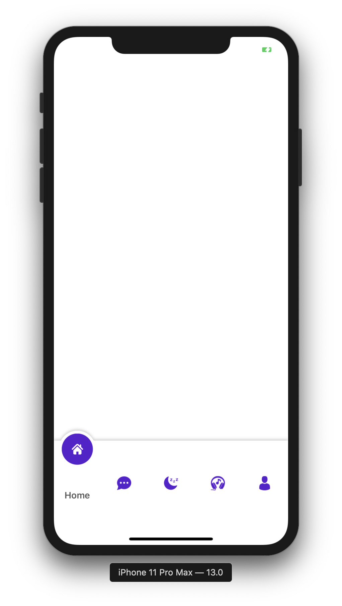
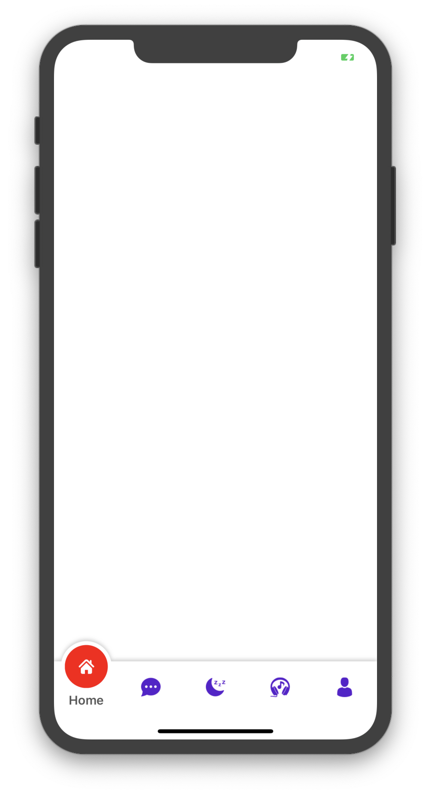
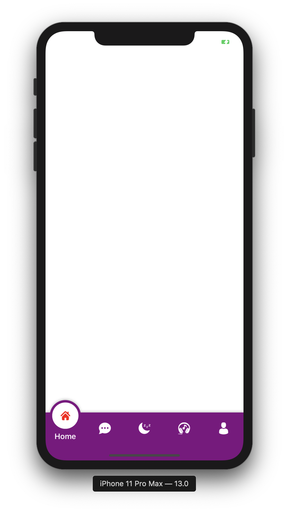
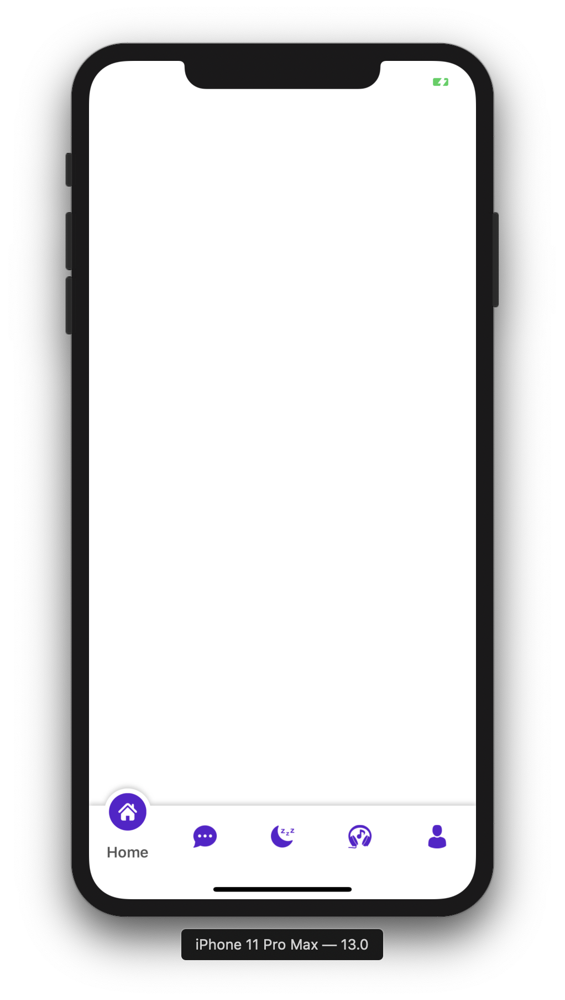
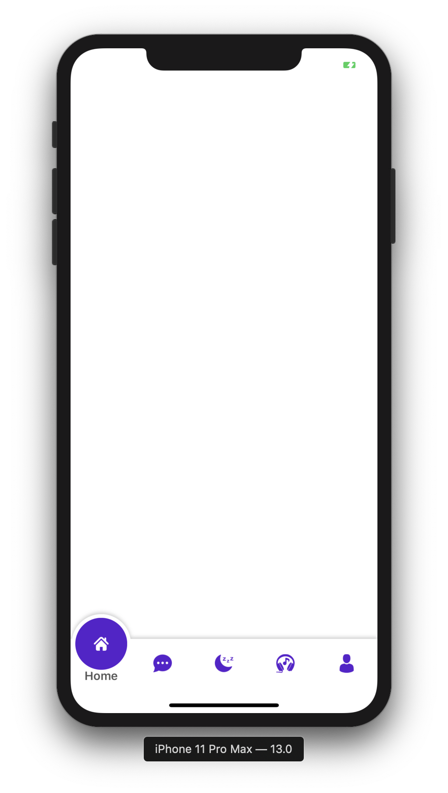
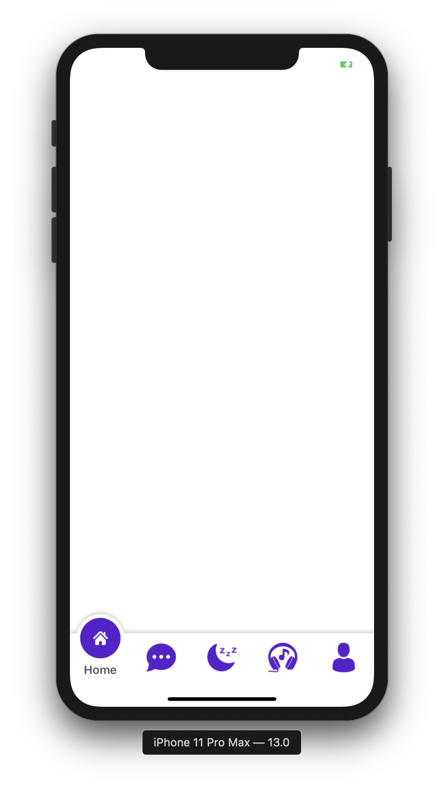
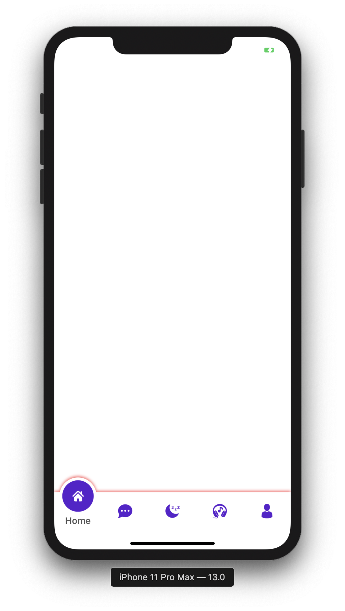

 <h1 align="center"> SOTabBar </h1>
<p align="center">
    <a href="https://travis-ci.org/Ahmadalsofi/SOTabBar">
        
    </a>
    
    <a href="https://cocoapods.org/pods/SOTabBar">
        
    </a>
	<a href="https://cocoapods.org/pods/SOTabBar">
        
    </a>
	<a href="https://github.com/Carthage/Carthage">
        
    </a>
  	<a href="https://cocoapods.org/pods/SOTabBar">
        
    </a>
	<a href="https://github.com/ahmadalsofi/sotabbar/releases">
        
    </a>
  <a href="https://github.com/Ahmadalsofi/SOTabBar/issues">
        
    </a>
  <a href="https://github.com/Ahmadalsofi/SOTabBar/releases">
        
    </a>
	<br>
	<br>
	<br>
	<br>
    
</p>


---
<a href="https://github.motakasoft.com/trending/?d=2020-01-08&l=swift">
<p align="center"></p>
</a>

---

## 📋 Requirements
SOTabBar requires iOS 9.3 or above, and is compatibile with Swift 4/5.

## 📲 Installation
### CocoaPods
SOTabBar is available through [CocoaPods](http://cocoapods.org):

```ruby
pod 'SOTabBar'
```

### Carthage
SOTabBar is also available through [Carthage](https://github.com/Carthage/Carthage):

```ogdl
github "Ahmadalsofi/SOTabBar"
```


## 🚀 Usage

### The Basics
1) Set up your view controller with the an array of view controllers that you want to appear.
2) Make  your main View Controller subclass from SOTabBarViewController.
3) return the array of your ViewControllers: 

```swift
import UIKit
import SOTabBar
class MainViewController: SOTabBarViewController {

    override func viewDidLoad() {
        super.viewDidLoad()
        
        let firstVC = UIStoryboard(name: "Main", bundle: nil).instantiateViewController(withIdentifier: "First_ID")
        let secondVC = UIStoryboard(name: "Main", bundle: nil).instantiateViewController(withIdentifier: "Second_ID")
       
        firstVC.tabBarItem = UITabBarItem(title: "Home", image: UIImage(named: "firstImage"), selectedImage: UIImage(named: "firstSelectedImage"))
        secondVC.tabBarItem = UITabBarItem(title: "Chat", image: UIImage(named: "secondImage"), selectedImage: UIImage(named: "secondSelectedImage"))
	
        viewControllers = [firstVC, secondVC]
    }
}
```
4) you can trigger your tab bar action by override the following function in your MainViewController
```swift
 override func soTabBar(_ tabBar: SOTabBarView, didSelectTabAt index: Int) {
      print("did Tapped On \(index)")
  }
```


## 🎨 Customization
**You should set your customization before return the array of the viewcontrollers**

```swift
class MainViewController: SOTabBarViewController {

    override func loadView() {
        super.loadView()
	    // SOTabBarSetting.propertyToCustomize = value
    }
}
```
#### tabBarHeight
```swift
    SOTabBarSetting.tabBarHeight = 100.0
```


#### tabBarTintColor
```swift
    SOTabBarSetting.tabBarTintColor = UIColor.red
```


#### tabBarBackground
```swift
    SOTabBarSetting.tabBarBackground = UIColor.purple
```


#### tabBarCircleSize
```swift
    SOTabBarSetting.tabBarCircleSize = CGSize(width: 50.0, height: 50.0)
  	 // or 
    SOTabBarSetting.tabBarCircleSize = CGSize(width: 80.0, height: 80.0)
```
 

#### tabBarSizeImage
```swift
    SOTabBarSetting.tabBarSizeImage = CGSize(width: 40.0, height: 40.0)
```


#### tabBarShadowColor
```swift
    SOTabBarSetting.tabBarShadowColor = UIColor.red.cgcolor
```


#### tabBarSizeSelectedImage
```swift
    SOTabBarSetting.tabBarSizeSelectedImage = CGSize(width: 40.0, height: 40.0)
```


#### tabBarAnimationDurationTime
```swift
    SOTabBarSetting.tabBarAnimationDurationTime = 2
```


## 👨🏻‍💻 Author
- Created by [Ahmad AlSofi](https://www.linkedin.com/in/ahmadalsofi/)
- Ahmadalsofi, alsofiahmad@yahoo.com

## ❤️ Contributing
Bug reports and pull requests are welcome on GitHub

## 👮🏻‍♂️ License
The library is available as open source under the terms of the [MIT License](http://opensource.org/licenses/MIT).
